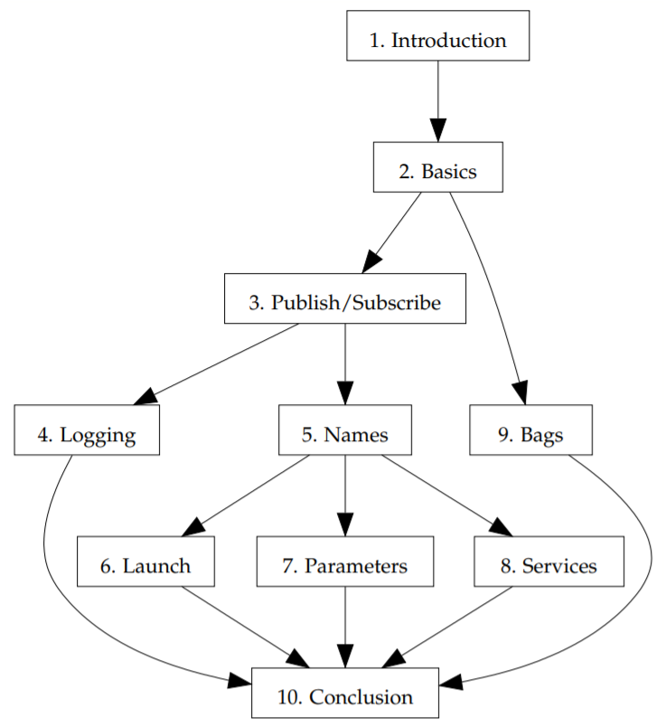

# What to expect

The goal of this book is to provide an integrated overview of the concepts and techniques you’ll need to know to write ROS software. This goal places a few important constraints on the content of the book.

- *This is not an introduction to programming*. We won’t discuss basic programming concepts in any great detail. This book assumes that you’ve studied C++ in sufficient depth to read, write, and understand code in that language.
- *This is not a reference manual*. There is plenty of detailed information about ROS, including both [tutorials](http://wiki.ros.org/ROS/Tutorials) and exhaustive reference [material](http://wiki.ros.org/APIs) available online. This book makes no attempt to replace those resources. Instead, we present a selected subset of ROS features that, in the author’s view, represents a useful starting point for using ROS.
- *This is not a textbook on robotics algorithms*. The study of robots, especially the study of algorithms for controlling autonomous robots, can be quite fascinating. A dizzying variety of algorithms have been developed for various parts of this problem. This book will not teach you any of those algorithms2. Our focus is on a specific tool, namely ROS, that can ease the implementation and testing of those algorithms.

## Chapters and dependencies

The figure below shows the organization of the book. Chapters are shown as rectangles; arrows show the major dependencies between them. It should be fairly reasonable to read this book in any order that follows those constraints.

  

## Intended audience

This book should be useful for both students in robotics courses and for researchers or hobbyists that want to get a quick start with ROS. We’ll assume that readers are comfortable with Linux (including tasks like using the command line, installing software, editing files, and setting environment variables), are familiar with C++, and want
to write software to control robots. Generally, we’ll assume that you are using Ubuntu Linux 14.04 (the newest version that is, at this writing, officially supported) and the bash shell. However, there are relatively few instances where these choices matter; other Linux distributions (especially those based on `deb` packages) and other shells will not usually be problematic.

---
2 . . . but you should learn them anyway.

